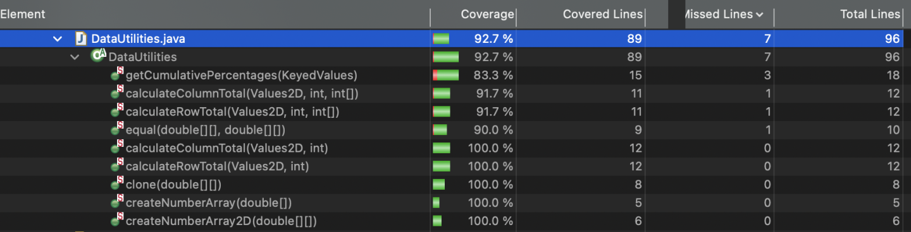
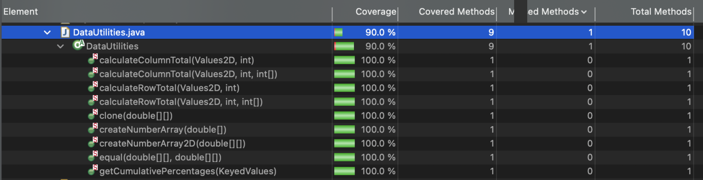

**SENG 637 - Dependability and Reliability of Software Systems**

**Lab. Report #3 – Code Coverage, Adequacy Criteria and Test Case Correlation**

| Group: 2         |
| ---------------- |
| Corey Yang-Smith |
| Eric (Sieu) Diep |
| Hao Liu          |
| Mehreen Akmal    |
| Jenn Bushey      |

# 1 Introduction

This lab was focused on white-box testing the Range and DataUtilities class in the JFreeChart framework. This lab is a continuation of the previous black-box testing lab. 

We began this lab by setting up our Eclipse environments with JFreeChart and evaluating our code with EclEmma coverage analysis program built-in to Eclipse.

By measuring the coverage of the JFreeChart framework, we will learned how to design effective test cases, improve code coverage, and assess the quality of their tests based on coverage metrics.

We refactored our test suite so that each method tested has its own java file and the `DataUtilitiesTest.java` and `RangeTest.java` files call each test suite for the individual methods. We found that this was a more efficient and easier to follow way to code the test suite.

# 2 Manual data-flow coverage calculations for `calculateColumnTotal` and `contains` methods

## DataUtilities.calculateColumnTotal()

### Data Flow Graph


### Def-Use Sets Per Statement

```
1.   public static double calculateColumnTotal(Values2D data, int column) {      // def - data, column
2.      ParamChecks.nullNotPermitted(data, "data");                              // use - data
3.      double total = 0.0;                                                      // def - total
4.      int rowCount = data.getRowCount();                                       // def - rowCount, use - data
5.      for (int r = 0; r < rowCount; r++) {                                     // def - r, use - r, rowCount
6.         Number n = data.getValue(r, column);                                  // def - n, use - data, r, column
7.         if (n != null) {                                                      // use - n
8.             total += n.doubleValue();                                         // use - total, use - n
9.         }
10.     }
11.     for (int r2 = 0; r2 > rowCount; r2++) {                                  // def - r2, use - r2, rowCount
12.        Number n = data.getValue(r2, column);                                 // def - n, use - data, r2, column
13.        if (n != null) {                                                      // use - n
14.            total += n.doubleValue();                                         // use - total, use - n
15.        }
16.     }
17.     return total;                                                            // use - total
18.  }
```

### DU Pairs Per Variable

**`calculateColumnTotal(Values2D data, int column)`:**

| Variable | DU Pairs                           |
| -------- | ---------------------------------- |
| data     | (1, 2), (1, 4), (1, 6), (1,12)     |
| column   | (1, 6), (1, 12)                    |
| total    | (3, 8), (3, 14), (3, 17)           |
| rowCount | (4, 5), (4, 11)                    |
| r        | (5, 5), (5, 6)                     |
| n        | (6, 7), (6, 8), (12, 13), (12, 14) |
| r2       | (11, 11), (11, 12)                 |

**Total DU Pairs for all variable: 19**

### For each test case show which pairs are covered

**`calculateColumnTotal(Values2D data, int column)`:**

| Method Name                                    | data               | column | total        | rowCount     | r           | n                | r2               | Total DU pair covered | % coverage |
| ---------------------------------------------- | ------------------ | ------ | ------------ | ------------ | ----------- | ---------------- | ---------------- | --------------------- | ---------- |
| calculateColumnTotalFirstColumn                | (1,2) (1,4) (1,6)  | (1,6)  | (3,8) (3,17) | (4,5) (4,11) | (5,5) (5,6) | (6,7) (6,8)      | (11,11)          | 12                    | 63.2       |
| calculateColumnTotalMiddleColumn               | (1,2) (1,4) (1,6)  | (1,6)  | (3,8) (3,17) | (4,5) (4,11) | (5,5) (5,6) | (6,7) (6,8)      | (11,11)          | 12                    | 63.2       |
| calculateColumnTotalLastColumn                 | (1,2) (1,4) (1,6)  | (1,6)  | (3,8) (3,17) | (4,5) (4,11) | (5,5) (5,6) | (6,7) (6,8)      | (11,11)          | 12                    | 63.2       |
| xcalculateColumnTotalWithNullDataItems         | (1,2) (1,4) (1,6)  | (1,6)  | (3,17)       | (4,5) (4,11) | (5,5) (5,6) | (6,7)            | (11,11)          | 10                    | 52.6       |
| xcalculateColumnTotalWithNullData              | (1,2)              |        |              |              |             |                  |                  | 1                     | 5.3        |
| calculateColumnTotalWithNegativeColumnIndex    | (1,2) (1,4) (1,6)  | (1,6)  | (3,8)        | (4,5)        | (5,5) (5,6) |                  |                  | 7                     | 36.8       |
| calculateColumnTotalWithOutOfBoundsColumnIndex | (1,2) (1,4) (1,6)  | (1,6)  | (3,8)        | (4,5)        | (5,5) (5,6) |                  |                  | 7                     | 36.8       |
| calculateColumnTotalWithNegativeRowCount       | (1,2) (1,4) (1,12) | (1,12) | (3,14)       | (4,5)        |             | (12, 13) (12,14) | (11, 11) (11,12) | 9                     | 47.4       |
| calculateColumnTotalWithMaxValueRowIndex       | (1,2) (1,4) (1,6)  | (1,6)  | (3,8) (3,17) | (4,5) (4,11) | (5,5) (5,6) | (6,7) (6,8)      | (11,11)          | 12                    | 63.2       |
| calculateColumnTotalWithMaxValueInRows         | (1,2) (1,4) (1,6)  | (1,6)  | (3,8) (3,17) | (4,5) (4,11) | (5,5) (5,6) | (6,7) (6,8)      | (11,11)          | 12                    | 63.2       |
| calculateColumnTotalWithMinValueInRows         | (1,2) (1,4) (1,6)  | (1,6)  | (3,8) (3,17) | (4,5) (4,11) | (5,5) (5,6) | (6,7) (6,8)      | (11,11)          | 12                    | 63.2       |

## Range.contains()

### Data Flow Graph


### Def-Use Sets Per Statement

```
1. public boolean contains(double value) { // def - value
2.        if (value < this.lower) {        // use - value, lower
3.           return false;
4.        }
5.        if (value  > this.upper) {       // use - value, upper
6.            return false;
7.        }
8.       return (value >= this.lower && value <= this.upper);   // use - value, lower, upper
9.   }
```

### DU Pairs Per Variable

| Variable | DU Pairs          |
| -------- | ----------------- |
| value    | (1,2) (1,5) (1,8) |

**Total DU Pairs: 3**

### For each test case show which pairs are covered

The object Range was instantiated with a range of (-10,10)
| Test Method Name |Test case| DU pairs | % coverage|
| ------------- |-------|-------|---|
| containsLowerBound | -10 | (1,8) | 33%|
| containsUpperBound | 10 | (1,8) | 33% |
| containsMidpoint | 0 | (1,8) | 33% |
| containsOutboundUpper | 11 | (1,5) | 33% |
| containsOutboundLower | -11 | (1,2) | 33% |

# 3 A detailed description of the testing strategy for the new unit test

As mentioned in the assignment document, we are required to design new unit tests for two classes, one for org.jfree.data.DataUtilities and one for org.jfree.data.Range. We have split this amongst the group members that have worked previously on those classes in Assignment 2.

Corey, Jenn & Eric has developed test cases for org.jfree.data.DataUtilities, while Mehreen, Hao & Eric have developed test cases for org.jfree.data.Range. Since we have completed test cases in the previous assignment, we have further analyzed the code coverage for these tests and have written additional test cases to ensure they meet the minimum coverage defined in the assignment document.

Additionally, the test suites developed have been designed to meet the minimum coverage criteria for classes under test as defined in the Assignment 3 markdown document as follows:

-   Minimum 90% statement coverage
-   Minimum 70% branch coverage
-   Minimum 60% condition coverage

Our team has decided to split up the test cases the same way that we have previously done in Assignment 2, and to write additonal test cases as needed to reach the required coverage, and to work on them individually. After ensuring our individual contributions are adequate, we will review each other's tests to ensure accuracy and look for any inconsistencies or defects within the tests themselves.

# 4 A high level description of five selected test cases you have designed using coverage information, and how they have increased code coverage

#### Testcase 1 for calculateColumnTotal(Values2D data, int column)

For this method, after viewing the source code it is evident that more coverage was needed. While not a great design of the class, the method allows for negative row count to be iterated through. This will inevtiably cause issues with the code running in an infinite loop, and surpassing the number of elements that have been initialized within the Values2D data structure.

Adjustments had to be made to the test cases to ensure that this case was covered and tests.

Additionally, the checking for null values was only considered originally if the entire Values2D object was null, not if the data members themselves were considered null. As such, and to increase the branch and instruction coverage, more tests were added to thoroughly test this method.

The resulting coverage has been summarize below:

-   Statement Coverage: 100%
-   Branch Coverage: 87.5%
-   Method Coverage: 100%
-   Instruction Coverage: 94.1%

Note however that while it would be possible to achieve a higher code coverage through writing additional test cases, examining the source code for this function reveals a critical flaw that allows the program to run with no stopping condition, which is not the intended function of this method. The code is such that one could consider a negative row count. While this isnt explicitly mentioned in the documentation, one could argue that it would be fair to consider only positive values for the count of rows. Therefore, we have only considered reasonable conditions for which a user would utilize this class and method.

Additionally, considering the test case that we have added, which tests for a negative row count, and therefore improves the code coverage of our class, examining the source code reveals that this test passes for the wrong reasons. As rows would be zero-based, we would expect an Exception to be thrown when initializing this data structure and calling the method; however, this is not the case. Instead, the test case passes because the program executes and is not able to find the desired values to sum, since the second loop of the function will run infinitely and will not be able to find correct values.

#### Testcase 2 for getLowerBound

For this method, first the test cases from assignment 2 were ran to see what the coverage was.

The resulting coverage has been summarized below:

-   Statement Coverage: 40%
-   Branch Coverage: 50%
-   Method Coverage: 100%
-   Instruction Coverage: 30%

The coverage did not meet the minimum coverage requirements. Thus, the source code was analyzed to investigate what lines and branches of the code were not covered. This was easily seen by the red and green colour code in the tool.

It was found that the method has an if statement for dectecting an invalid range (lower > upper). This made up 50% of the number of branches in the getLowerBound method, and was not covered. See the pictures below.


A test case was implemented where an invalid range was passed to the range object (5, 2) . Upon testing again the coverage was still 50% for branch and 40% for line. The code was not being implemented for if lower < upper. The rest of the code was analyzed and it was found that the constructor has the same if statement that checks for invalid range as well which was throwing an exception and that is why the code never gets to the if statement within this method.

#### TestCase 3 for expand

For the Range class's expand() method, the coverage was initially 75% for branches and lines. After reviewing the source code, we realized that lower test coverage was because we only tested it with positive and zero margins, and consequently, the if (lower > upper) code statements was never executed. To increase test coverage, we introduced a negative margin of -2 for the lower margin and 0.5 for the upper margin and calculated the lower and upper values to be 3 and 2, respectively. This resulted in a lower > upper condition, which triggered the if statement to execute the related code and recalculate the new lower and upper values to both be 2.5. This adjustment improved the line and branch coverage to 100%.

#### Testcase 4 for getLength

The coverage results are:

-   Statement Coverage: 40%
-   Branch Coverage: 50%
-   Method Coverage: 100%
-   Instruction Coverage: 36.4%

After careful review of the class source code, it was evident that the low coverage result shown above is due to the design of the class source code and cannot be improved without modifying it.

In the design of the getLength() method, there are two branches: one is if (lower > upper) throw IllegalArgumentException, and the other is if (lower <= upper).


However, the first branch will never be executed because it would be caught and an exception thrown by the constructor upon creation of a range object. This is because the constructor has exactly the same logic/code for this case. No Range object with a lower range > upper range can call the getLength method. 50% of the branch in this method cannot be tested.

The lower and upper variables are private to the Range class, and there is no setter method for them, so there is no way to modify their values after an object is created through construction. Due to the above reasons, the coverage of the getLength() method cannot be further improved in this case.

** Note **
Due to the low coverage

#### Testcase 5 for getCumulativePercentage

The coverage results are:

-   Statement Coverage: 83.3%
-   Branch Coverage: 75%
-   Method Coverage: 100%
-   Instruction Coverage: 85.2%

The minimum coverage requirement for statement is 90%. Upon analyzing the source code to improve these metrics, it was found that the for loop below would be impossible to reach:

```
    for (int i2 = 0; i2 > data.getItemCount(); i2++) {
            Number v = data.getValue(i2);
            if (v != null) {
                total = total + v.doubleValue();
            }
        }
```

Since data.getItemCount() would always be greater or equal to 0, and i2 starts at 0. The conditions in this for loop will never be met regardless of the test cases. This is the reason that we cannot achieve 90% coverage for the statement.

# 5 A detailed report of the coverage achieved of each class and method (a screen shot from the code cover results in green and red color would suffice)

## Range Coverage

| Method Name                               | statement | branch      | method   | instruction |
| ----------------------------------------- | --------- | ----------- | -------- | ----------- |
| `combine(Range, Range)`                   | 100%      | 100%        | 100%     | 100%        |
| `combineIgnoringNaN(Range, Range)`        | 100%      | 92.9%       | 100%     | 100%        |
| `expand(Range, double, double)`           | 100%      | 100%        | 100%     | 100%        |
| `expandToInclude(Range, double)`          | 100%      | 100%        | 100%     | 100%        |
| `max(double, double)`                     | 100%      | 100%        | 100%     | 100%        |
| `min(double, double)`                     | 100%      | 100%        | 100%     | 100%        |
| `scale(Range base, double factor)`        | 100%      | 100%        | 100%     | 100%        |
| `shift(Range, double)`                    | 100%      | 100%        | 100%     | 100%        |
| `shift(Range, double, boolean)`           | 100%      | no branches | 100%     | 100%        |
| `shiftWithNoZeroCrossing(double, double)` | 80%       | 75%         | 100%     | 75%         |
| `constrain(double)`                       | 100%      | 100%        | 100%     | 100%        |
| `contains(double)`                        | 100%      | 87.5%       | 100%     | 100%        |
| `equals(Object)`                          | 100%      | 100%        | 100%     | 100%        |
| `getCentralValue()`                       | 100%      | no branches | 100%     | 100%        |
| `getLength()`                             | 40%       | 50%         | 100%     | 36.4%       |
| `getLowerBound()`                         | 40%       | 50%         | 100%     | 30%         |
| `getUpperBound()`                         | 40%       | 50%         | 100%     | 30%         |
| `hashCode()`                              | 100%      | no branches | 100%     | 100%        |
| `intersects(double, double)`              | 100%      | 100%        | 100%     | 100%        |
| `intersects(Range)`                       | 100%      | no branches | 100%     | 100%        |
| `isNaNRange()`                            | 100%      | 100%        | 100%     | 100%        |
| `toString()`                              | 100%      | no branches | 100%     | 100%        |
| **TOTAL**                                 | **91.6%** | **92.7%**   | **100%** | **87.7%**   |


## DataUtilities Coverage

| Method Name                                       | statement | branch    | method   | instruction |
| ------------------------------------------------- | --------- | --------- | -------- | ----------- |
| `calculateColumnTotal(Values2D data, int column)` | 100%      | 87.5%     | 100%     | 94.1%       |
| `calculateColumnTotal(Values2D, int, int[])`      | 91.7%     | 87.5%     | 100%     | 95.3%       |
| `calculateRowTotal(Values2D data, int row)`       | 100%      | 87.5%     | 100%     | 94.1%       |
| `calculateRowTotal(Values2D, int, int[])`         | 91.7%     | 87.5%     | 100%     | 95.1%       |
| `clone(double[][] source)`                        | 100%      | 100%      | 100%     | 100%        |
| `createNumberArray(double[] data)`                | 100%      | 100%      | 100%     | 100%        |
| `createNumberArray2D(double[][] data)`            | 100%      | 100%      | 100%     | 100%        |
| `equal(equal(double[][] a, double[][] b))`        | 90%       | 75%       | 100%     | 84.6%       |
| `getCumulativePercentages(KeyedValues data)`      | 83.3%     | 75%       | 100%     | 85.2%       |
| **TOTAL**                                         | **92.7%** | **84.4%** | **100%** | **93.7%**   |






# 6 Pros and Cons of coverage tools used and Metrics you report

### Coverage Tools

We used EclEmma as it is a coverage tool that is built-in to Eclipse.

**Pros:**

-   We already use Eclipse IDE so this was the most simple tool to implement.
-   Didn't need to download or install anything new.

**Cons:**

-   The user interface made it difficult to figure out which coverage type was being displayed.
-   There is no condition coverage.
-   Lack of documentation: it is difficult to find the documentation explaining the metrics used in EcLemma on the EcLemma website. After an extensive search, it was found that EcLmma used Jacoco library. So in this lab, the meaning of the metrics used is intepreted according to Jacoco https://www.eclemma.org/jacoco/trunk/doc/counters.html.

### Statement Coverage

**Pros:**

-   Simple to understand and calculate
-   Quickly identify code not tested by test suite

**Cons:**

-   Too rudimental: high score does not guarantee the test cases are catching all bugs
-   Does not consider branches so the test cases may not catch all bugs

### Branch Coverage

**Pros:**

-   Identifies missing paths
-   Detects logic errors in the code such as incorrect conditions

**Cons:**

-   This method is more complex to evaluate than statement coverage
-   Only covers branches within conditional statements and does not consider all execution paths

### Method Coverage

**Pros:**

-   Helps identify the number of methods are not being called by the test suite

**Cons:**

-   Is a measure of implementation, not of the completeness or correctness of the method
-   Not useful to catch bugs. According to the documentation "A method is considered as executed when at least one instruction has been executed", this explains the high 100% rate in the report above.

### Instruction Coverage

-   According to EcLemma documentation, instruction coverage measures the number of byte code executed. Thus, it is assumed that the instruction coverage is similar to conditions coverage

**Pros:**

-   The higher % of the conditions coverage, the more bugs can be catch potentially as it checks if the logics excecuted is correct.
-   It can catch the edge cases where the other method cannot catch

**Cons:**

-   More efforts requried and more time consuming to check all the conditions.
-   Could be complex depends on the conditions.

# 7 A comparison on the advantages and disadvantages of requirements-based test generation and coverage-based test generation.

Requirements-based test generation
**Pros:**

-   Ensures software meets user and stakeholder needs which aligns testing efforts with business objectives
-   Allows for non-technical stakeholder involvement during testing
-   Helps detect defects or inconsistencies in the requirements themselves early in the development process
    **Cons:**
-   Can be challenging to generate test cases if requirements are ambigious

Coverage-based test generation
**Pros:**

-   Detailed analysis and testing at the code level
-   Ensures all parts of the code are being executed
-   Allow efficient testing using coverage tools which automate testing
-   Able to detect bugs

**Cons:**

-   Require programming knowledge and access to source code
-   Focus is on code coverage which could introduce a gap in functionality testing as requirements are not validated
-   Focus on code execution rather than domain-specific requirements
-   May not explore all possible code paths or edge cases which could results in missing defects that are only revealed during thorough code level testing

Coverage-based testing primarily focuses on conducting code-level analysis to ensure thoroughness in testing by systematically evaluating different aspects of code execution, requiring testers to possess programming knowledge and access to the source code. This approach provides detailed insights into code execution paths, facilitating comprehensive code coverage. On the other hand, requirements-based testing prioritizes validating software against stakeholder needs and business objectives, making it more accessible to non-technical stakeholders. However, it may overlook certain code-level intricacies. While coverage-based testing aims for comprehensive code coverage, requirements-based testing ensures alignment with user needs and business requirements. Furthermore, requirements-based testing is effective in early defect detection within requirements, while coverage-based testing offers a detailed analysis of code to uncover defects and enhance code quality.

# 8 A discussion on how the team work/effort was divided and managed

We divided the test suite in the same way as Assignment 2 as seen below. We then compared our results and collaborated to analyze our findings.

| <h3>Range Class Methods</h3>              | <h3>Tested By </h3> |
| ----------------------------------------- | ------------------- |
| `combine(Range, Range)`                   | Hao                 |
| `combineIgnoringNaN(Range, Range)`        | Hao                 |
| `expand(Range, double, double)`           | Mehreen             |
| `expandToInclude(Range, double)`          | Mehreen             |
| `scale(Range, double)`                    | Jenn                |
| `shift(Range, double)`                    | Mehreen             |
| `shift(Range, double, boolean)`           | Mehreen             |
| `shiftWithNoZeroCrossing(double, double)` | Mehreen             |
| `constrain(double)`                       | Hao                 |
| `contains(double)`                        | Eric                |
| `equals(Object)`                          | Eric                |
| `getCentralValue()`                       | Hao                 |
| `getLength()`                             | Hao                 |
| `getLowerBound()`                         | Mehreen             |
| `getUpperBound()`                         | Mehreen             |
| `hashCode()`                              | Hao                 |
| `intersects(double, double)`              | Hao                 |
| `intersects(Range)`                       | Hao                 |
| `isNaNRange()`                            | Mehreen             |
| `toString()`                              | Jenn                |

| <h3>DataUtilities Class Methods</h3>              | <h3>Tested By </h3> |
| ------------------------------------------------- | ------------------- |
| `calculateColumnTotal(Values2D data, int column)` | Corey               |
| `calculateColumnTotal(Values2D, int, int[])`      | Corey               |
| `calculateRowTotal(Values2D data, int row)`       | Corey               |
| `calculateRowTotal(Values2D, int, int[])`         | Corey               |
| `clone(double[][] source)`                        | Jenn                |
| `createNumberArray(double[] data)`                | Jenn                |
| `createNumberArray2D(double[][] data)`            | Jenn                |
| `equal(equal(double[][] a, double[][] b))`        | Jenn                |
| `getCumulativePercentages(KeyedValues data)`      | Eric                |

# 9 Any difficulties encountered, challenges overcome, and lessons learned from performing the lab

Difficulties encountered during white box testing are the following:

-   Determining the optimal number of test cases to ensure sufficiency without redundancy, as well as assessing whether the designed test cases adequately cover the system's requirements regardless of achieving high coverage metrics

A lesson learned from conducting the lab is that while high coverage is beneficial, it does not guarantee fault-free software; however, it is preferable to random testing as it provides a structured approach to identifying and addressing potential defects within the software.

# 10 Comments/feedback on the lab itself

The layout and steps of the lab itself made it easy to follow and complete the assignment tasks.

We ran into difficulty determining whether the lab is asking us to revise the methods covered in Assignment 2 or create test cases for all 23 methods in Range Class and all 9 methods in the DataUtilities Class.
